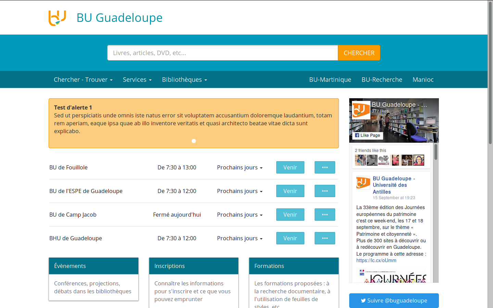

Angole Drupal Theme
===================

This is a Boostrap subtheme based on the CDN starter kit.

Custom Regions
--------------

Used to display the search form in the blue header on BU Martinique and BU Guadeloupe:

    regions[header]         = 'Top Bar'

Used to build a two columns layout for the content type Bibliothèque:

    regions[content_left]   = 'Content Left'
    regions[content_right]  = 'Content Right'
    regions[content_left2]  = 'Content Left 2'
    regions[content_right2] = 'Content Right 2'

Used to build a three columns layout containing menus at the bottom of BU Recherche homepage:

    regions[prefooter1]     = 'Pre Footer 1'
    regions[prefooter2]     = 'Pre Footer 2'
    regions[prefooter3]     = 'Pre Footer 3'

For the four columns footer:

    regions[footer1]        = 'Footer 1'
    regions[footer2]        = 'Footer 2'
    regions[footer3]        = 'Footer 3'
    regions[footer4]        = 'Footer 4'

The dark blue bar at the very bottom of the theme:

    regions[copyright]      = 'Copyright'

Custom templates
----------------

Two menu hooks where implemented to display the front-menu as cards. The front-menu is a drupal menu displayed on the front pages of BU Martinique and BU Guadeloupe. We had to implement those hooks to display the menu entries descriptions in the body of the cards. This is done in `template.php`.

`templates/system/page.tpl.php` and `templates/system/page.vars.php` where overriden to create the custom regions described above.

Custom javascript
-----------------

[readmore.js](http://jedfoster.com/Readmore.js/) was used to manage overflows [on this kind of pages](http://buguadeloupe.univ-ag.fr/ebooks).
